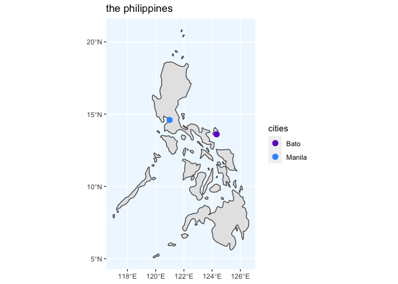

### a little about me…

hi, i’m nicole (she/her), currently an undergrad studying computer
science and data science at smith college. i’m a problem solving
enthusiast. besides all these techy stuff, i love taylor swift🎶,
singing🎙, and reading📖.

------------------------------------------------------------------------

### currently working on…

-   getting my bachelor degree in computer science and statistical &
    data science from Smith College, MA
-   learning C
-   developing my understanding of R

------------------------------------------------------------------------

### where i’m from…

i was born in manila, philippines, but spent a large part of my
childhood in the island of bato, catanduanes before moving to the united
states.

<!-- -->

------------------------------------------------------------------------

### call me, beep me if you wanna reach me…

feel free to reach me [by email](nicoletresvalles01@gmail.com), or any
of my socials!
